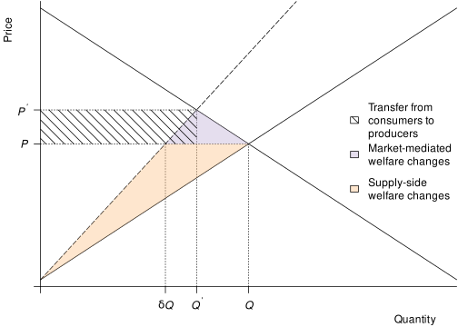
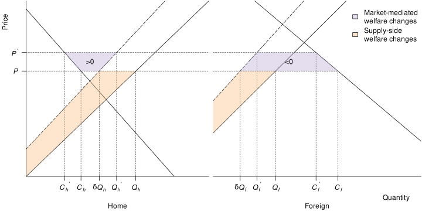
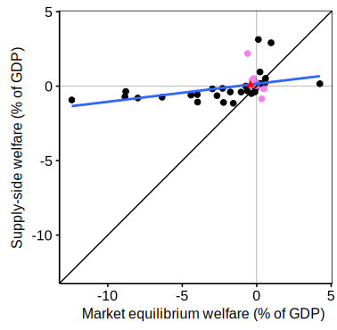

# Markets Are Adaptation, Too: Rethinking Who Gains and Who Loses from Climate Change in Agriculture

Author

Christophe Gouel

Published

December 12, 2025

Abstract

This post is a reproduction of [PREFALIM Policy Brief 1](https://www.pepr-faircarbon.fr/content/download/1095/12299?version=1).  
Most of us picture climate change hurting farmers because it hurts yields. We also picture “adaptation” as technology—new varieties, different planting dates, smarter irrigation. This post adds a missing piece: markets are adaptation, too. Because climate shocks are uneven across crops and places, prices move, trade reroutes, and land is reallocated—and once those adjustments occur, winners and losers can look very different from the picture you get from a supply-side perspective, in which prices are kept fixed. Two simple ideas drive the difference. First, foods are not freely interchangeable in people’s diets, so the cost of a typical food basket can rise even if some crops do better under climate change. Second, countries that rely on food imports are exposed when world prices rise, while some large exporters may benefit from higher selling prices despite lower yields. Using a global model, letting prices adjust produces an overall economic loss equivalent to 0.43% of world GDP, whereas the fixed‑price calculation—applied to the same climate shocks—shows a small gain of 0.08%. At the country level, 19 of 50 countries switch sign between the two views, and in 38 of 50 the market‑aware measure is lower than the fixed‑price number. The lesson is straightforward: prices reorganize the impacts of climate change. If you ignore them, you risk getting both the size and the direction wrong.

# Adaptation, expanded: technology and markets

The familiar story runs like this: climate change lowers yields, farmers lose, so countries with worse weather get poorer. That chain of reasoning feels natural because it follows the production side of agriculture—the agronomy—and a narrow view of “adaptation” to climate change centered on technology (new varieties, altered planting dates, irrigation upgrades, better pest management). It misses a second form of adaptation that is less visible because it works in the background of the global food system: markets. Because climate shocks are uneven across crops and places, relative prices change—and those price signals drive three margins of adjustment: consumer switching among products, trade reallocation, and land reallocation.

Those market responses are not an afterthought; they are built in. And they mean the effects we care about—on producers, consumers, and national welfare—need not track local yields one for one. A country with modest agronomic outcomes might lose more if it is a net importer of a staple whose world price jumps. Another, even with mixed yield outcomes, might gain if it is a major exporter whose selling price improves. Market-mediated adaptation is coordinated by price movements and works along three margins:

- Consumer switching among products. When relative prices change, households substitute toward cheaper foods and away from dearer ones, within dietary and processing limits. Because staples are imperfect substitutes, the food price index often rises when multiple staples are hit.
- Trade reallocation. Countries import more of what they find more difficult to grow and export what becomes relatively competitive. This reshuffling changes a country’s terms of trade—the rate at which it exchanges exports for imports.
- Land reallocation. Within each country, cropland shifts toward crops with better relative returns. Climate-driven yield changes can induce reallocation even at constant prices, but price movements alter the direction and scale of these shifts.

These mechanisms work even without any new technology. Leaving them out of impact measurement is not a benign simplification—it biases our view of who is hurt and by how much. We now clarify the mechanisms through which markets mediate the effect of climate change.

## A single-country example

To clarify the role of markets in adaptation, consider a closed country growing only one crop. This example is illustrated by [Figure 1](#fig-1-country). Climate change can be represented as a pivotal shift of the supply curve to the left, reducing supply for all prices. In this closed, one‑good economy, a leftward pivot of the supply curve raises the domestic price and reduces the quantity demanded. The new equilibrium sits above and to the left of the original: less is produced and consumed, and the price is higher.

Figure 1: Market-mediated adaptations are modest in a one-good, one-country setting.  
**Subtitle**: Welfare changes from climate change in a one-good, closed-economy.  
**Notes**: Initial equilibrium (\\Q, P\\) and equilibrium after climate change (\\Q', P'\\). Climate change is represented as a pivotal shift to the left of the supply curve reducing production at constant price to \\\delta Q\\. The orange area corresponds to the welfare change assuming constant price, and the purple area corresponds to the additional welfare change when the price is allowed to adjust.  
**Source**: Adapted from Gouel ([2025, fig. 1](#ref-Goue22))

Because demand and supply meet in a single market for one good, the extra welfare effect of letting the price adjust is small—the tiny triangle between the fixed‑price counterfactual and the new market equilibrium. In this simplified setting, a fixed‑price “supply‑side” calculation gives a reasonable approximation to the total welfare change. But focusing only on the country’s aggregate welfare can hide who bears the loss. The higher price transfers surplus from consumers to producers. Staple foods typically have very low demand elasticity, so even small production declines can trigger large price increases—as seen during the recent global food price spike associated with the war in Ukraine. In such situations, consumers tend to be the ultimate losers, while producers can be more than compensated for lower output by the higher price.

## An open-economy example

In an open economy with two countries—Home and Foreign—trading one agricultural good, the same negative climate shock pivots both supply curves to the left. World demand and trade arbitrage pin down a single price. As that world price rises, Home (the initial net exporter) ships less but at a higher price, while Foreign (the initial net importer) purchases less and pays more. [Figure 2](#fig-2-country) depicts the welfare accounting: the orange areas measure the fixed‑price (supply‑side) evaluation at the benchmark price; the purple areas capture the additional change once the price is allowed to adjust.

Figure 2: Market-mediated adaptations can become large in open economy.  
**Subtitle**: Welfare changes from climate change in a one-good, two-country economy.  
**Notes**: Initial equilibrium (\\C_h, C_f, Q_h, Q_f, P\\) and equilibrium after climate change (\\C_h', C_f', Q_h', Q_f', P'\\). Climate change is represented as a pivotal shift to the left of the supply curves by \\\delta\\. The orange areas correspond to the welfare changes assuming constant price, and the purple areas correspond to the additional welfare changes when the price is allowed to adjust.  
**Source**: Adapted from Gouel ([2025, fig. 2](#ref-Goue22))

For the exporter (Home), the fixed‑price approach overstates the welfare loss because it ignores the improvement in the terms of trade: part of the domestic loss is offset by selling fewer units at a higher price. For the importer (Foreign), the fixed‑price approach understates the loss: beyond the domestic effect of the supply shift, the country pays more for every imported unit, so the welfare loss is aggravated compared with a fixed-price setting. In this two‑country setting the importer’s welfare change associated with market mediation is larger in absolute value than the exporter’s, and the two terms have opposite signs. Aggregating across countries cancels these price-change transfers (i.e., terms-of-trade transfers), so the world‑level market-mediated welfare change is the same small purple one found in the single‑country (autarky) case ([Figure 1](#fig-1-country)).

How large the country‑level terms-of-trade effect becomes depends on the size of the climate shock, how uneven it is across countries, each country’s trade share, and demand and supply elasticities. For an exporting country, suffering a yield shock relatively smaller than the global shock, the terms‑of‑trade component dominates and market‑mediated adaptation becomes the main driver of the difference between fixed‑price and full‑equilibrium welfare.

## Imperfect substitution in consumption

The other important margin of market-mediated adjustment is that foods are imperfect substitutes in consumption. To clarify what this means, imagine households buy two staples: grains and oils. Climate change hurts grains but helps oils. Even if the average agronomic effect across the two crops looks mild, these products play different roles in diets, and people can’t replace bread with cooking oil one-for-one.

When the grain becomes scarcer, its price rises more than the oil price falls. Households may shift just a bit toward oil, but not much. The cost of a typical grocery basket goes up. A fixed-price tally would treat the grain loss and the oil gain as offsetting—possibly even neutral. Once prices adjust, the cost of eating rises because the newly expensive item is hard to substitute away from. That’s why a market-aware measure can show a loss even when one crop improved.

# From intuition to global evidence

Together, these two forces interact: imperfect substitution tends to make the world as a whole worse off once prices adjust, while terms of trade redistribute gains and losses across countries depending on trade positions. To understand the eventual effect of these adjustment margins, one has to combine them into a global food market model. We implement this in the global model of Gouel and Laborde ([2021](#ref-Goue21)): 50 countries, 35 crop categories (including grass for pasture), production allocated over a grid of agricultural land, calibrated to observed production, consumption, and trade flows, and shocked with climate-driven agronomic yield changes from GAEZ ([IIASA/FAO 2021](#ref-IIAS21)).

The analysis studies the question of the climate impact on agriculture in two ways: first, the fixed-price view that mimics the “supply-side” approach; second, a full market-equilibrium view where prices, demand, trade, and land allocation adjust across crops and countries.

Two features matter most for interpretation. On the demand side, foods are not perfectly substitutable, so the cost of a typical basket can rise even if some crops do better. On the trade side, imports are calibrated to reproduce observed trade flows and the model adopts a gravity framework, implying that relative price changes shift a country’s terms of trade. This set-up lets us see when the fixed-price number is a reasonable shortcut and when it misleads.

## Results

At the world level, letting prices adjust produces a welfare loss of about 0.43 percent of world GDP, whereas the fixed-price calculation shows a small gain of about 0.08 percent ([Gouel 2025](#ref-Goue22), Tab. 4). The sign difference comes from the fact that when several staples become relatively scarcer, households cannot fully substitute across foods, implying that the food basket becomes more expensive. At the aggregate level, ignoring limited substitution can make it seem that gains on some crops offset losses on others.

At the country level, the ranking changes even more between the approaches. Nineteen out of fifty countries switch sign between the fixed-price and market-equilibrium measures, and in thirty-eight the market-aware welfare is lower than the fixed-price number (see [Figure 3](#fig-welf)). Because foods are imperfect substitutes, welfare changes under the fixed-price approach are often substantially smaller than under market equilibrium—and can even have the wrong sign. Because of the role of terms of trade, a useful rule of thumb to understand a country’s situation is trade position: net importers tend to fare worse once prices move, while some major exporters look better because their selling prices improve. None of this implies that all households share a gain or loss. Producer gains can coexist with consumer losses, and the split between rural and urban households matters.

Figure 3: Welfare changes differ markedly between supply-side and market-equilibrium approaches.  
**Subtitle**: Welfare effects of climate change on agriculture under the two approaches.  
**Notes**: The points in pink in the top-left and bottom-right quadrants correspond to countries whose welfare measures have opposite signs, the triangle is world welfare, and the blue line is the regression line.  
**Source**: Adapted from Gouel ([2025, fig. 4](#ref-Goue22))

These patterns are not artifacts of a single calibration. When substitution possibilities are made unrealistically high and trade frictions very small, the two measures of welfare change converge, for the reasons above. In plausible ranges of parameters, though, the gap persists because of imperfect substitution and terms of trade.

Other sensitivity exercises that raise substitution elasticities, assume tighter market integration, or add an intensive margin (more output per hectare as prices rise) change magnitudes but not the basic lesson: price movements and trade patterns are central to welfare, and ignoring them can reverse the direction of the effect.

# Using the results

Why mention the fixed-price perspective at all? Because much of the influential literature on climate impacts in agriculture—starting with the Ricardian approach of Mendelsohn et al. ([1994](#ref-Mend94)) and the panel-profit tradition (e.g., [Deschênes and Greenstone 2007](#ref-Desc07))—estimates how climate or weather affects land values or farm profits while holding output prices fixed, at least implicitly. These reduced-form studies are valuable: they capture farm-level adjustment margins such as switching crops or technologies, and they identify local responses with relatively few structural assumptions.

The trouble begins when such estimates are read as welfare for a country or the world. By construction they set aside market-mediated channels—relative price changes, trade and demand reallocation, and the induced reshuffling of land—that our results show can materially change both the magnitude and the sign of impacts. In other words, these studies are best seen as measuring producer-side responses at given prices, not the total effect on producers and consumers once prices move.

A practical way forward is integration, not replacement. Use reduced-form evidence to discipline how yields and profits respond locally; then embed those responses in an explicit market setting that lets prices and trade adjust. Read in this way, the earlier literature remains essential. It tells us what farmers can do on their own margins; the equilibrium step tells us how those actions play out once prices adjust. The contribution of Gouel ([2025](#ref-Goue22)) is to make that link explicit and to show when it matters most.

# References

Deschênes, Olivier, and Michael Greenstone. 2007. “The Economic Impacts of Climate Change: Evidence from Agricultural Output and Random Fluctuations in Weather.” *The American Economic Review* 97 (1): 354–85. <https://doi.org/10.1257/aer.97.1.354>.

Gouel, Christophe. 2025. “Measuring Climate Change Impacts on Agriculture: An Equilibrium Perspective on Supply-Side Approaches.” *Journal of the Association of Environmental and Resource Economists* 12 (1): 181–220. <https://doi.org/10.1086/730591>.

Gouel, Christophe, and David Laborde. 2021. “The Crucial Role of Domestic and International Market-Mediated Adaptation to Climate Change.” *Journal of Environmental Economics and Management* 106: 102408. <https://doi.org/10.1016/j.jeem.2020.102408>.

IIASA/FAO. 2021. *Global Agro-ecological Zones (GAEZ V4)*. IIASA, Laxenburg, Austria; FAO, Rome, Italy. <https://gaez.fao.org>.

Mendelsohn, Robert O., William D Nordhaus, and Daigee Shaw. 1994. “The Impact of Global Warming on Agriculture: A Ricardian Analysis.” *The American Economic Review* 84 (4): 753–71. <http://www.jstor.org/stable/2118029>.
